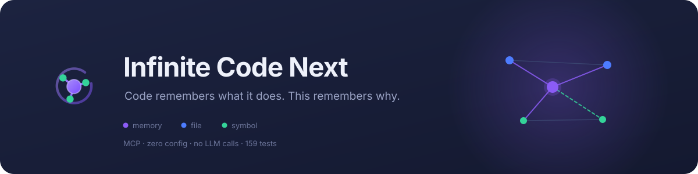
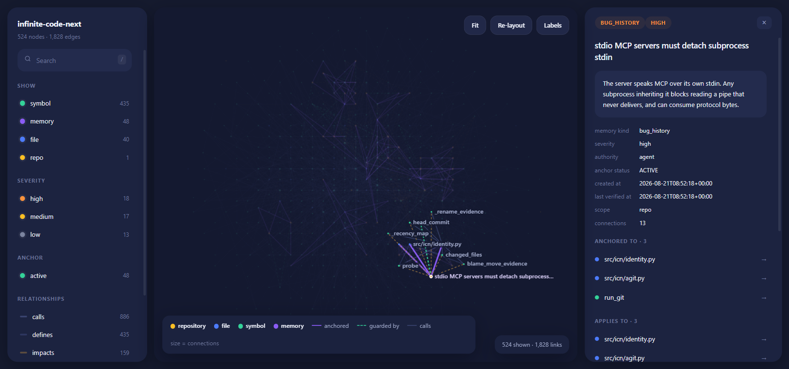
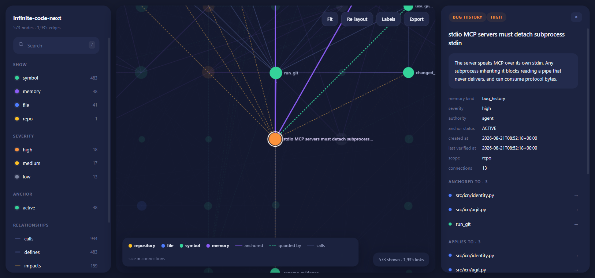
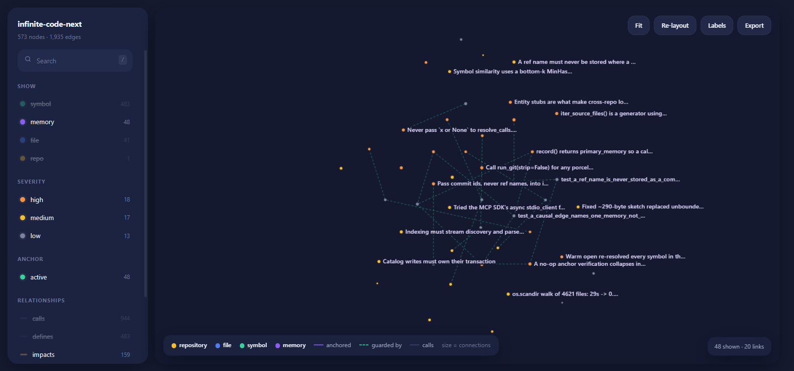
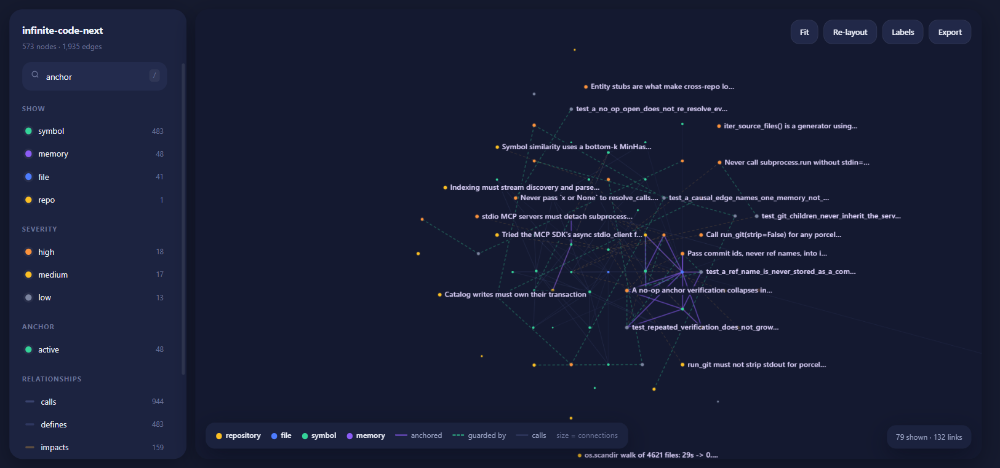

<div align="center">



A zero-config MCP server that gives AI coding agents persistent, verifiable
memory of a codebase — the decisions behind it, what was already tried and
rejected, and what must never break — anchored to the code and carried with it
as the code moves.

[](#testing)
[](#quick-start)
[](#quick-start)
[](#no-llm-in-the-loop)

**[Quick start](#quick-start) · [Agent setup](AGENT_SETUP.md) · [Explorer](#the-knowledge-explorer) ·
[Sharing](#sharing-knowledge) · [For agents](#guide-for-ai-agents) ·
[How it works](#how-it-works) · [Brand](#brand)**

</div>

---

> Git blame tells you *who* changed a line.
> This tells an agent **why the code exists**, **what was already tried and
> rejected**, and **what must stay true** — and it knows when its own knowledge
> has gone stale.

---

## The problem

Every session, an AI agent arrives with no memory. It reads files to
re-derive what the last agent already knew. Then it re-proposes the fix that
was rejected three months ago, because nothing in the repository records that
it was tried.

The expensive knowledge is never in the code:

| The code says | It never says |
|---|---|
| `stdin=subprocess.DEVNULL` | *why* — that git inherits the MCP pipe and stalls every call for 20s |
| `if touched:` | that `or None` here means "resolve everything" and costs minutes |
| A coordinator class | that a Redis mutex was tried first and deadlocks on partition |

This server stores that layer, keeps it attached to the code, and tells you
when it can no longer vouch for it.

---

## Quick start

```bash
pip install -e .
```

Register once with your MCP client — there is no second step. No admin panel,
no port, no daemon, no per-repository setup.

<table>
<tr><td><b>Claude Code</b></td><td>

```bash
claude mcp add icn -- infinite-code-next
```

</td></tr>
<tr><td><b>Codex</b><br><sub>~/.codex/config.toml</sub></td><td>

```toml
[mcp_servers.icn]
command = 'infinite-code-next'
args = []
```

</td></tr>
<tr><td><b>Any MCP client</b></td><td>

```json
{ "mcpServers": { "icn": { "command": "infinite-code-next" } } }
```

</td></tr>
</table>

The server works out which repository it is in from its working directory, and
every response echoes the root it resolved, so a wrong workspace is obvious
immediately.

Verify the complete client setup, including a real stdio handshake, tool
discovery, repository open, and parser/index health:

```bash
icn doctor --client codex --root /path/to/repository
```

If the client was already running when ICN was installed or configured,
restart it after the doctor reports `READY` so its deferred tool catalogue is
refreshed.

### The loop

```
workspace(action="open")          →  a briefing: rules, prior failures, what is unverified
investigate("what you're doing")  →  code + rationale + blast radius, budgeted
        ... do the work ...
record(summary=..., warnings=[...], failed_attempts=[...])
```

Two calls to get productive. One to leave the next agent smarter.

---

## The knowledge explorer

Everything the server knows — repository, files, symbols, memories, and every
edge between them — as one interactive graph.

```bash
./explore.sh          # macOS / Linux
explore.bat           # Windows
icn-explore           # if the package is on your PATH
```

<div align="center">

</div>

Above: the export menu open over the full graph.

<table>
<tr>
<td width="50%"></td>
<td width="50%"></td>
</tr>
<tr>
<td><b>Select a node</b> and its neighbourhood lights up — the files it is
anchored to (violet), the test that guards it (green, dashed), the symbols it
impacts (amber, dashed). Everything else fades back.</td>
<td><b>Filter structure away</b> and you are left with the knowledge layer
alone: 48 memories and the tests covering them. This view is what no other
tool in your stack can draw.</td>
</tr>
<tr>
<td colspan="2"></td>
</tr>
<tr>
<td colspan="2"><b>Search narrows live</b> — 573 nodes down to 79 for
<code>anchor</code>, across code and knowledge at once. Export "copy visible"
then turns whatever is left on screen into a shareable subset.</td>
</tr>
</table>

| | |
|---|---|
| **Filter** | by node type, memory severity, anchor status, or edge kind — counts update live |
| **Search** | any node by name, path, or the text of its body |
| **Inspect** | click a node for its full body, metadata, and every typed connection |
| **Navigate** | click any connection to jump there — walk from a warning to the code it guards to the test that covers it |
| **Zoom & pan** | scroll and drag; node size is call-degree, so load-bearing code looks load-bearing |
| **Export** | markdown, graph JSON, the page itself, a PNG, or just what is currently on screen |

Self-contained: one HTML file with the data inlined. No CDN, no build step, no
npm. Save it, email it, commit it — it still works.

```bash
icn-explore --no-serve -o graph.html    # just write the file
icn-explore --port 8080                 # pick the port
icn-explore --include-deleted           # include tombstoned code
```

---

## Sharing knowledge

Hand another codebase's hard-won knowledge to someone else — or to another
agent.

### From the explorer

The **Export** button offers everything below without leaving the page. It all
runs offline in the browser against the embedded graph — no server call, so a
saved page still exports.

| | |
|---|---|
| **Markdown** | readable anywhere, and re-importable |
| **Graph JSON** | nodes and edges, raw |
| **This page** | the self-contained explorer, to send to someone |
| **Image** | PNG of the current view |
| **Copy visible** | *only what is on screen* — filter and search first, and the filtered view becomes a shareable subset |

### From the CLI

```bash
icn-explore export -o knowledge.md      # readable markdown, renders anywhere
icn-explore export -o knowledge.icn     # bundle: markdown + graph
icn-explore export -o graph.json        # raw graph
```

The markdown is the canonical shareable form, and it is **readable on its
own** — in an editor, in a diff, on a wiki, in a pull request. A knowledge
base nobody can read without the tool is a knowledge base nobody checks. A
JSON block at the end makes the import lossless.

```bash
icn-explore import knowledge.icn        # bring it in
icn-explore import ./team-knowledge/    # a whole directory of .md / .icn
icn-explore import shared.md --preview  # look first, import nothing
```

**Import never overwrites.** Everything from outside is stored as
`authority='imported'` with its origin attached, and anchored only where a
matching symbol actually exists here. A memory about code you do not have is
still worth keeping — but it must not claim to describe a span it never saw.

---

## Guide for AI agents

Read this section before your first call.

### 1. Open first — do not read files to orient yourself

```python
workspace(action="open")
```

Returns a **briefing**: the rules that govern this code, what has already been
tried and rejected, what is currently unverified, and where knowledge is
concentrated. Headlines and ids only — bodies stay out, `investigate()` is one
call away.

This exists because of a measured failure. Every session building this server
began by reading files to re-derive knowledge that already existed. `open` used
to report symbol counts, which tells you nothing about what you are walking
into. **You cannot ask the right question before you know what is on the
shelf.**

### 2. Investigate in plain language — not with grep

```python
investigate("I need to change refresh token rotation. What will I break?")
```

For one bounded investigation across several repositories, pass their roots
explicitly. This does not require pre-existing contract edges:

```python
investigate(
    query="change the trip-notification event contract",
    roots=["/work/accounting-service", "/work/be-nf-service", "/work/be-service"],
    intent="modify",
)
```

`cross_repos=True` remains the provenance-aware mode that follows recorded
contracts. `roots=[...]` is the explicit search scope for repositories that
have not yet had those contracts recorded.

### Recommended global agent instruction

Installing an MCP server does not guarantee an agent will proactively use it.
Add the following short instruction to the agent's global instruction file.
Keep it short: the MCP tool descriptions teach the detailed workflow after the
first call.

#### Codex (`~/.codex/AGENTS.md`)

```markdown
## Infinite Code Next (ICN)
- For any task involving an existing codebase, use ICN. At the beginning of a session and whenever you switch repositories, discover deferred tools if necessary and call `mcp__icn__workspace(action="open", root=<repo>)`.
- Before investigating, diagnosing, designing, or modifying code, call `mcp__icn__investigate(query=<task>, intent=<intent>, root=<repo>)`. Treat memories whose anchor status is not `ACTIVE` as unverified leads.
- After verified findings or changes, call `mcp__icn__record` with the decision, failure prevented, affected files/symbols, invariants, warnings, failed attempts, contracts, and tests. Skip investigation and recording only for purely mechanical actions such as correcting a typo or running an explicitly requested command.
- If `mcp__icn__*` is not visible, search the available/deferred tool catalogue and load it. If it still cannot be loaded, explicitly report that ICN is unavailable and continue with the best evidence. Never silently skip ICN or claim it was used when it was not.
```

#### Claude Code (`~/.claude/CLAUDE.md`)

```markdown
## Infinite Code Next (ICN)
- For any task involving an existing codebase, use ICN. At the beginning of a session and whenever you switch repositories, ensure the `icn` MCP server and its tools are loaded and call `workspace(action="open", root=<repo>)`.
- Before investigating, diagnosing, designing, or modifying code, call `investigate(query=<task>, intent=<intent>, root=<repo>)`. Treat memories whose anchor status is not `ACTIVE` as unverified leads.
- After verified findings or changes, call `record` with the decision, failure prevented, affected files/symbols, invariants, warnings, failed attempts, contracts, and tests. Skip investigation and recording only for purely mechanical actions such as correcting a typo or running an explicitly requested command.
- If ICN is not loaded, try to reconnect or load the configured `icn` MCP server. If it remains unavailable, explicitly report that fact and continue with the best evidence. Never silently skip ICN or claim it was used when it was not.
```

For repository-local enforcement, place the same block in that repository's
`AGENTS.md` or `CLAUDE.md`. Global instructions are preferable when ICN should
be used across every repository.

See [Agent setup and required instructions](AGENT_SETUP.md) for the full
installation, verification, and copy-paste setup process.

One call fuses lexical search, symbol lookup, code-graph traversal,
memory-graph traversal, anchor status and git history, and returns compact
capsules under a token budget. It searches **code and knowledge together**, so
a warning finds you even when you never named the file it lives in.

| Argument | Use it for |
|---|---|
| `intent=` | `locate`, `understand`, `modify`, `debug`, `audit` — inferred if omitted |
| `budget=` | approximate token ceiling (default 9000) |
| `cross_repos=True` | follow contracts into other repositories |
| `find_problems=` | targeted diagnostics over the narrowed subgraph |

### 3. Before deleting anything load-bearing, ask why

```python
investigate(action="why", symbol="RefreshCoordinator.acquire")
```

```
decision: Use refresh-token rotation
  --was followed by--> bug_history: Parallel refresh requests invalidate each other
  --was followed by--> failed_attempt: Redis mutex could deadlock during a partition
  --was followed by--> * invariant: All refreshes pass through RefreshCoordinator

may reintroduce: Parallel refresh requests invalidate each other
regression tests: test_parallel_refresh_regression
```

A flat list of five memories makes you reconstruct the story. A chain hands it
over.

### 4. Record what you learned — especially the failures

```python
record(
    kind="bug_fix",
    summary="Serialize refresh requests per session",
    reasoning="Parallel requests rotated the same token.",
    invariants=["All refreshes for one session pass through RefreshCoordinator"],
    warnings=["Do not bypass RefreshCoordinator for new refresh entry points"],
    failed_attempts=["Redis mutex deadlocks during a network partition"],
    symbols=["RefreshCoordinator.acquire"],
    tests=["test_parallel_refresh_regression"],
    caused_by=[previous_memory_id],
)
```

**`failed_attempts` is the highest-value field in the whole system.** Nothing
else in your toolchain records what was tried and rejected, and it is what
future agents find most expensive to rediscover.

`record()` returns `primary_memory` — the id representing this event. Pass it
as the next `caused_by`.

<details>
<summary><b>Every field record() accepts</b></summary>

| Field | Records |
|---|---|
| `invariants` | things that must remain true |
| `warnings` | things a future agent must not do |
| `failed_attempts` | what was tried and rejected, and why |
| `decisions` | choices made, and the alternatives rejected |
| `contracts` | assumptions other code relies on |
| `security` | security-relevant facts |
| `performance` | measured performance facts |
| `bugs` | bugs this code has caused before |
| `migrations` | migration steps or ordering constraints |
| `conventions` | local conventions worth following |
| `rationale` | why the code is shaped this way |
| `tests` | tests that cover this — creates a `GUARDED_BY` edge |
| `contracts_with` | cross-repository dependencies |
| `caused_by` | memory ids this event follows from |

</details>

### 5. Trust the labels

Every memory carries an `anchor_status`. Anything other than `ACTIVE` has
**not** been verified against the current code — treat it as a lead, not a
fact.

```python
memory(action="verify", memory_id=..., reason="confirmed it still applies")
memory(action="guard", memory_id=rule_id, body=test_memory_id)
memory(action="supersede", memory_id=..., body="what is true now")
```

---

## How it works

### Anchors that know when they are stale

A memory is not stored at `src/auth/oauth.ts:193`. Line numbers are a
rendering detail. Each memory attaches to a **semantic anchor**: the symbol
path, an AST path, a content fingerprint (structure + identifiers), a skeleton
fingerprint (structure only), and its surrounding context.

When code changes, a cascade relocates the anchor — cheapest test first:

| Step | Test | Result |
|:--:|---|---|
| 1 | Same fingerprint, same place | `ACTIVE` · 1.0 |
| 2 | Same fingerprint elsewhere, confirmed by `git blame -C -M` | `ACTIVE` · 0.9, moved |
| 3a | Same place, skeleton identical — a rename | `ACTIVE` · 0.8 |
| 3b | Same place, structure changed | **`NEEDS_REVIEW`** |
| 4 | Symbol gone, strong similarity match | `DRIFTED`, re-anchored |
| 5 | Nothing clears the bar | `ORPHANED` — kept, never deleted |

Two rules make this trustworthy:

- **Verification fires on the edit that caused the drift**, not on a timer.
- **The cascade can only lower trust, never raise it.** Once `DRIFTED` or
  `NEEDS_REVIEW`, only an explicit `memory(action="verify")` returns an anchor
  to `ACTIVE` — otherwise the next pass would find its freshly re-anchored
  fingerprint matching, report "unchanged", and quietly re-trust a memory
  nobody ever confirmed.

### Problem detection

`investigate()` narrows to a subgraph first, then asks targeted questions of
it — never a workspace-wide scan. What separates these from a linter is that
they are **knowledge-aware**: a linter sees a function has no test; only this
graph knows the function is governed by an invariant recorded after a
production incident.

| Finding | Question it answers |
|---|---|
| `stale_knowledge` | which memories drifted from the code they describe |
| `bypassed_wrapper` | is a caller reaching past a coordinator or guard |
| `untested_invariant` | is a governed rule reachable by no test |
| `deprecated_with_callers` | does a deprecated symbol still have live callers |
| `unguarded_equivalent` | does a structurally identical sibling lack the rule |
| `implementation_drifted_from_decision` | did the code diverge from what was decided |
| `knowledge_conflict` | do two memories contradict each other |
| `historical_implementation` | is active knowledge pointing at deleted code |
| `unverifiable_contract` | is a cross-repo dependency currently uncheckable |
| `unreviewed_caller` | did a caller appear after the memory was verified |
| `migration_candidate` | did code plausibly move where the cascade would not follow |

A failing detector never breaks the search: a diagnostic enhances an answer,
it is not a precondition for one.

### No LLM in the loop

`record()` is fully deterministic — entity resolution, edge derivation and
contradiction detection are graph operations, not model calls. **No API key,
no network, no token cost.** Ranking is a static, inspectable formula with
per-intent weights, because a fresh local install has no labeled relevance
data to train a reranker on.

### Search that tolerates how people type

Exact and prefix matching runs first; when it finds nothing, an approximate
pass takes over, so `subproces` still finds the subprocess warning. Hyphenation
is bridged in both directions — `reanchor` finds text saying `re-anchor` and
vice versa — because FTS5's tokenizer splits on hyphens and neither spelling
would otherwise reach the other.

The fallback is deliberately a fallback: FTS ranking beats anything computed
locally when it has hits at all, so running fuzzy matching by default would let
loose matches outrank exact ones.

### Ranking learns from use

Every memory tracks how often it was surfaced and how often an agent opened it
in full. Opening is weighted far higher — being shown only means the query
matched, while being opened means an agent chose it out of everything it saw.

The boost is bounded at 0.5 and decays with a 45-day half-life. Frequency is
evidence, not authority: unbounded, it would pin last month's popular memory
above a critical warning recorded yesterday.

### Storage

```
%LOCALAPPDATA%\InfiniteCode\               (Windows)
$XDG_DATA_HOME/infinite-code/              (Linux)
~/Library/Application Support/InfiniteCode/ (macOS)

  catalog.db                repositories, aliases, checkouts, cross-repo edges
  data/repos/<id>/repo.db   DURABLE      code graph, memories, anchors, events
  cache/repos/<id>/         REBUILDABLE  safe to delete at any time

<repo>/.agit/               agent git, gitignored
<repo>/.icn.toml            optional, committed, tiny
```

Override the root with `INFINITE_CODE_HOME`.

Identity is never the path and never the remote URL — both are mutable. It is
derived from the root commit, an optional committed project id, and normalised
remotes, so moving a clone or running `git remote set-url` reattaches to
existing knowledge. A **fork** shares upstream's root commit, so it is split
explicitly rather than silently inheriting upstream's memories.

### Nothing is ever destroyed

- Deleted symbols become **tombstones** with their last known path and the
  commit that removed them.
- Edges carry `valid_from_commit` / `valid_until_commit` and become
  `HISTORICAL` rather than disappearing.
- A vanished checkout is `MISSING`; an unmounted drive is `OFFLINE`. Neither
  deletes anything.
- Corrections version the previous text; supersession keeps both memories and
  the link between them.
- An agent **cannot** rewrite a human-authored memory — it must supersede it,
  leaving the disagreement visible.
- `purge` is the only destructive operation, and requires `confirm=True`.

Lookups go through a resolver that never raises: "cannot currently resolve" is
returned as data, with whatever was last known.

---

## Brand

<table>
<tr>
<td width="130" align="center"></td>
<td>

The mark is the product's one idea: a piece of **knowledge** (violet) anchored
to **code** (green) that would otherwise carry no memory of it. The ring is
left open — knowledge is never finished being verified.

Stroke weights are set so the shape survives to a 16px favicon: the memory node
stays dominant and the three anchors read as a triangle even when the ring
blurs away.

</td>
</tr>
</table>

| | Hex | Means |
|---|---|---|
|  | `#8b5cf6` | memory, anchoring — knowledge |
|  | `#34d399` | symbols, tests — verified code |
|  | `#4d7cfe` | files — structure |
|  | `#fbbf24` | repository, caution |
|  | `#f4677c` | critical, causal chains |
|  | `#1c2340` | card surface |
|  | `#151a2e` | ground |

One rule governs the whole UI: **structure is quiet, knowledge is loud.**
`CALLS` and `DEFINES` recede into the background so that anchor and causal
edges — the thing no other tool can show you — carry the colour.

Assets live in [`assets/`](assets/); the explorer's own source is
[`src/icn/web/`](src/icn/web/):

```
src/icn/web/
  explorer.html    shell and markup
  explorer.css     the design system above, as custom properties
  explorer.js      force layout, canvas rendering, inspector
  mark.svg         logo
  banner.svg       header
```

Real `.html`, `.css` and `.js` rather than string literals, so an editor
treats them as what they are. They are inlined at render time, because the
published page must stay a single self-contained file.

---

## Tools

| Tool | Actions |
|---|---|
| `workspace` | `open` · `status` · `list` · `reindex` · `health` · `reconcile` · `archive` · `detach` · `forget_checkout` · `purge` |
| `investigate` | search · `why` · `expand` · `verify` |
| `record` | one event → many anchored facts |
| `memory` | `get` · `list` · `verify` · `guard` · `correct` · `supersede` · `resolve` · `reanchor` |
| `agit` | `status` · `diff` · `commit` · `log` · `branches` · `switch` · `restore` · `reset` · `show` |

`agit` keeps agent checkpoints in `.agit/`, entirely separate from the user's
`.git`. Checkpoint risky work, restore it, never touch their history.

---

## Testing

```bash
python -m pytest
```

**177 tests**, including a live MCP suite that spawns the real server over
stdio and drives a full agent workflow through the wire protocol, and a
dirty-worktree harness that asserts cascade behaviour on **uncommitted** edits
— reformat, rename, body change, cross-file move, delete, weak migration.

That regime is unvalidated by the published literature, which only ever
measures post-hoc commit-history mining, so it is measured here directly.

The live test earns its keep. It found a bug in-process testing cannot see:
subprocess calls inherited the server's stdin, which *is* the MCP protocol
pipe. Git blocked on it for its full 20-second timeout on every tool call and
could swallow protocol bytes. Fixing it took tool latency from **20s to 0.2s**.

### Measured on a real 4,621-file repository

| | |
|---|---|
| Full index | 593s → 34,747 symbols, 58,857 edges, 43,038 call edges |
| Warm open | **0.77s** |
| Query | **1.48s** |

---

## Design

The reasoning behind each decision lives next to the code it governs: every
module's docstring states what it does and, more importantly, **which failure
it exists to prevent**. `anchors.py` explains why the cascade may only lower
trust, `briefing.py` why `open` volunteers a summary, `causal.py` why
causality is asserted and never inferred.

Planning notes are kept locally and are not part of the shipped artifact.

---

<div align="center">

**Built by [Ranit Bhowmick](https://ranitbhowmick.com)**

<sub>If an agent had to read your codebase to understand it, that knowledge
died with the session. This is the fix.</sub>

</div>
